<!-- markdownlint-disable MD033 MD036 MD041 -->

<p align="center">
  <a href="https://v2.nonebot.dev/"></a>
</p>

<div align="center">

nonebot-plugin-access-control-api
============

_✨ Nonebot 权限控制插件（插件适配API） ✨_

</div>


<p align="center">
  <a href="https://raw.githubusercontent.com/ssttkkl/nonebot-plugin-access-control-api/master/LICENSE">
    
  </a>
  <a href="https://pypi.python.org/pypi/nonebot-plugin-access-control-api">
    
  </a>
  
</p>

为插件开发者提供适配[nonebot-plugin-access-control](https://github.com/bot-ssttkkl/nonebot-plugin-access-control)的API，插件开发者可以在不引入本体实现的情况下适配access-control，避免污染用户环境。

## 插件适配

完整代码：[src/nonebot_plugin_ac_demo/matcher_demo.py](src/nonebot_plugin_ac_demo/matcher_demo.py)

1. 创建一个名为nonebot_plugin_ac_demo的插件

2. 通过create_plugin_service函数创建一个PluginService实例（注意参数必须为插件包名）

```python
from nonebot import require

require("nonebot_plugin_access_control_api")

from nonebot_plugin_access_control_api.service import create_plugin_service

plugin_service = create_plugin_service("nonebot_plugin_ac_demo")
```

3. 通过PluginService.create_subservice创建SubService实例。调用`Service.patch_matcher()`
   应用至Matcher，或在事件处理函数上应用装饰器`Service.patch_handle()`。（二选一）

```python
group1 = plugin_service.create_subservice("group1")

a_matcher = on_command('a')
a_service = group1.create_subservice('a')
a_service.patch_matcher(a_matcher)


@a_matcher.handle()
async def _(matcher: Matcher):
    await matcher.send("a")


b_matcher = on_command('b')
b_service = group1.create_subservice('b')
b_service.patch_matcher(b_matcher)


@b_matcher.handle()
async def _(matcher: Matcher):
    await matcher.send("b")


c_matcher = on_command('c')
c_service = plugin_service.create_subservice('c')


@c_matcher.handle()
@c_service.patch_handler()  # 必须在 @c_matcher.handle() 之下
async def _(matcher: Matcher):
    ok = do_your_logic()

    if not ok:
        # 功能执行失败时，收回限流消耗的次数
        await current_rate_limit_token.get().retire()
        return 

    await matcher.send("c")

```

插件服务的结构如下所示：



4. 通过指令配置服务权限

执行下面的指令后，所有用户将无法调用指令`/a`与`/b`

```
/ac permission deny --sbj all --srv nonebot_plugin_ac_demo.group1
```

执行下面的指令后，QQ用户12345678将无法调用指令`/a`

```
/ac permission deny --sbj qq:12345678 --srv nonebot_plugin_ac_demo.group1.a
```

执行下面的指令后，QQ群组87654321的所有用户将无法调用除`/c`以外的任何指令

```
/ac permission deny --sbj qq:g87654321 --srv nonebot_plugin_ac_demo
/ac permission allow --sbj qq:g87654321 --srv nonebot_plugin_ac_demo.c
```

5. 手动鉴权

对于非Matcher的功能入口（如APScheduler的定时任务等），需要开发者手动进行鉴权。当然，对于Matcher，如果自动鉴权不能满足你的需求，你也可以使用手动鉴权。

- 方法一：调用`service.check(Bot, Event)`方法，传入Bot及Event实例，返回bool值表示该用户是否具有权限。
调用`service.acquire_token_for_rate_limit(Bot, Event)`方法，传入Bot及Event实例，返回token。
若token不为None表示限流次数扣除成功，后续可通过`token.retire()`收回限流消耗的次数。

- 方法二：调用`service.check_by_subject(*str)`方法，传入主体字符串，返回bool值表示该用户是否具有权限。
调用`service.acquire_token_for_rate_limit_by_subject(*str)`方法，传入主体字符串，返回token。
若token不为None表示限流次数扣除成功，后续可通过`token.retire()`收回限流消耗的次数。

APScheduler示例：[src/nonebot_plugin_ac_demo/apscheduler_demo.py](src/nonebot_plugin_ac_demo/apscheduler_demo.py)

Matcher手动鉴权示例：

```python
d_matcher = on_command('d')
d_service = plugin_service.create_subservice('d')


@d_matcher.handle()
async def _(bot: Bot, event: Event, matcher: Matcher):
    if not await d_service.check(bot, event, acquire_rate_limit_token=False):
        # 没有权限
        await matcher.finish()

    token = await d_service.acquire_token_for_rate_limit(bot, event)
    if token is None:
        # 已达到限流次数上线
        await matcher.finish()

    ok = do_your_logic()

    if not ok:
        # 功能执行失败时，收回限流消耗的次数
        await token.retire()

    await matcher.send("c")
```

6. 事件订阅

通过`service.on_set_permission`、`service.on_remove_permission`、`service.on_change_permission`方法可以订阅事件，具体如下表：

| 装饰器                                 | 事件类型                                  | 事件接收函数的参数                   |
|-------------------------------------|---------------------------------------|-----------------------------|
| `service.on_set_permission`         | 服务设置主体权限                              | service：服务<br>permission：权限 |
| `service.on_remove_permission`      | 服务删除主体权限                              | service：服务<br>subject：主体    |
| `service.on_change_permission`      | 服务变更主体权限（包括该服务及其所有祖先服务设置、删除权限导致的权限变更） | service：服务<br>permission：权限 |
| `service.on_add_rate_limit_rule`    | 服务添加限流规则（该服务及其所有祖先服务添加限流规则时都会触发）      | service：服务<br>rule：限流规则     |
| `service.on_remove_rate_limit_rule` | 服务删除限流规则（该服务及其所有祖先服务删除限流规则时都会触发）      | service：服务<br>rule：限流规则     |

**调用事件接收函数时通过具名参数传参，因此事件接收函数的参数必须严格遵循参数名。**

事件订阅示例：[src/nonebot_plugin_ac_demo/event_demo.py](src/nonebot_plugin_ac_demo/event_demo.py)

## 拓展定义新的主体

主体提取器（Subject Extractor）用于提取事件发出用户所具有的主体。开发者可以在自己的插件中注册自定义的主体提取器，从而实现拓展定义新的主体。

主体提取器为一个函数（或可调用对象），其应该具有如下的函数签名，并通过`add_subject_extractor`装饰器注入到插件中：

```python
@add_subject_extractor
def your_custom_subject_extractor(bot: Bot, event: Event, manager: SubjectManager):
    ...
```

传入参数`bot`与`event`其义自明，而`manager`参数提供方法用于添加主体。

主体的模型定义如下：

```python
class SubjectModel(NamedTuple):
    content: str
    offer_by: str
    tag: Optional[str]
```

其中content为主体字符串，offer_by用于标识提取出该主体的主体提取器（通常为插件名），tag用于标识主体的种类。通常我们约定，拥有同一个tag的主体包含的信息量完全一致。

在主体提取流程，插件会**按顺序依次**调用已注册的主体提取器，请注意维护主体提取器注册的顺序。（tips：如果你的主体提取器依赖其他插件中实现的主体提取器，可以依赖`nonebot`
提供的`require`机制控制主体提取器注册的顺序）

例如，下面这个主体提取器用于为OneBot V11协议中群管理/群主提取相应的主体：

```python
OFFER_BY = "nonebot_plugin_access_control"


def extract_onebot_v11_group_role(bot: Bot, event: Event, manager: SubjectManager):
    if bot.type != "OneBot V11":
        return

    group_id = getattr(event, "group_id", None)
    sender: Optional["Sender"] = getattr(event, "sender", None)

    if group_id is not None and sender is not None:
        li = []

        if sender.role == "owner":
            li.append(
                SubjectModel(
                    f"qq:g{group_id}.group_owner", OFFER_BY, "qq:group.group_owner"
                )
            )
            li.append(SubjectModel("qq:group_owner", OFFER_BY, "qq:group_owner"))

        if sender.role == "owner" or sender.role == "admin":
            li.append(
                SubjectModel(
                    f"qq:g{group_id}.group_admin", OFFER_BY, "qq:group.group_admin"
                )
            )
            li.append(SubjectModel("qq:group_admin", OFFER_BY, "qq:group_admin"))

        # 添加在platform:group之前
        manager.insert_before("platform:group", *li)
```

## 在线乞讨

<details><summary>点击请我打两把maimai</summary>


</details>

## LICENSE

> MIT License
>
> Copyright (c) 2022 ssttkkl
>
> Permission is hereby granted, free of charge, to any person obtaining a copy
> of this software and associated documentation files (the "Software"), to deal
> in the Software without restriction, including without limitation the rights
> to use, copy, modify, merge, publish, distribute, sublicense, and/or sell
> copies of the Software, and to permit persons to whom the Software is
> furnished to do so, subject to the following conditions:
>
> The above copyright notice and this permission notice shall be included in all
> copies or substantial portions of the Software.
>
> THE SOFTWARE IS PROVIDED "AS IS", WITHOUT WARRANTY OF ANY KIND, EXPRESS OR
> IMPLIED, INCLUDING BUT NOT LIMITED TO THE WARRANTIES OF MERCHANTABILITY,
> FITNESS FOR A PARTICULAR PURPOSE AND NONINFRINGEMENT. IN NO EVENT SHALL THE
> AUTHORS OR COPYRIGHT HOLDERS BE LIABLE FOR ANY CLAIM, DAMAGES OR OTHER
> LIABILITY, WHETHER IN AN ACTION OF CONTRACT, TORT OR OTHERWISE, ARISING FROM,
> OUT OF OR IN CONNECTION WITH THE SOFTWARE OR THE USE OR OTHER DEALINGS IN THE
> SOFTWARE.
> 
